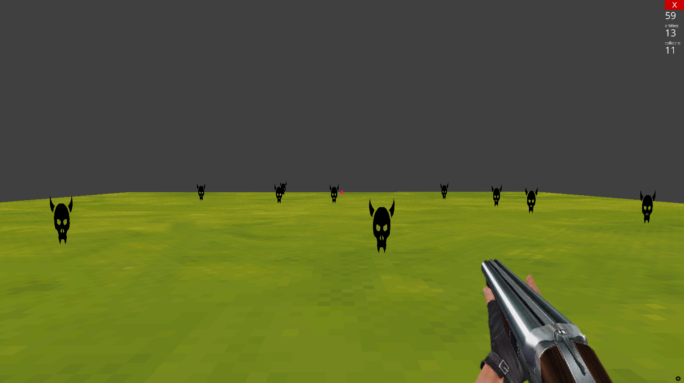

# FPS Game with Ursina Engine  

This is a simple First-Person Shooter (FPS) game created using the **Ursina Game Engine**. The game features a basic environment, a player controller, a gun model, and enemies that the player can shoot.  

## Features  
- **First-Person Controller**: Move around the environment using the `W`, `A`, `S`, `D` keys and the mouse to look around.  
- **Gun Model**: A basic gun model attached to the camera.  
- **Enemy Spawning**: Randomly spawn enemies in the environment.  
- **Shooting Mechanic**: Shoot enemies by clicking the left mouse button.  
- **Raycasting**: Detect enemies in front of the player within a set range.  

## Requirements  
To run this game, you need:  
- Python 3.6 or later  
- The Ursina Engine (`pip install ursina`)  
- `gun.png` (gun texture)  
- `enemy.png` (enemy texture)  

## Game Screenshot


## Installation  
1. Clone this repository:  
   ```bash
   git clone https://github.com/rashedulhridoy/fps-game.git
   cd fps-game
    ```
   
